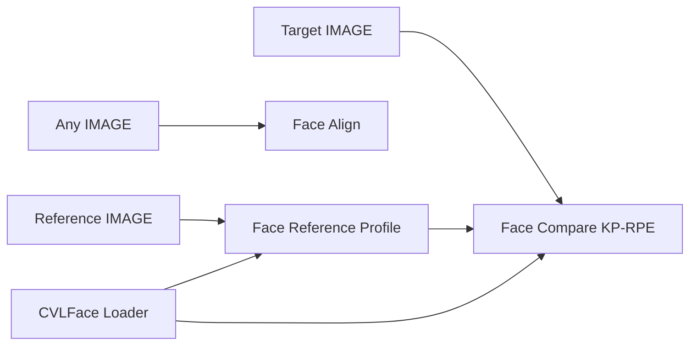

# comfyui-CVLFace-Verification

ComfyUI custom nodes for **local face verification** using **CVLFace ViT KP-RPE** (AdaFace-style embeddings with keypoint-relative positional encoding). **InsightFace buffalo_l** handles detection and dense landmarks; embeddings are computed entirely from files under **ComfyUI/models/** — no Hugging Face Hub calls and no automatic downloads from this pack.

## What it does

1. **Detect and align** faces in ComfyUI `IMAGE` tensors (112×112 ArcFace-style crop).
2. **Build a reference profile** from one or more reference images (L2-normalized embeddings + detection-quality weights).
3. **Compare** a target image against that profile (cosine similarity per reference, aggregate score, pass/fail match).

All four nodes appear under **Add Node → CVLFace**.

## Requirements

| Component | Notes |
|-----------|--------|
| **ComfyUI** | Custom nodes loaded via `NODE_CLASS_MAPPINGS` in `__init__.py` ([ComfyUI custom-node lifecycle](https://docs.comfy.org/custom-nodes/backend/lifecycle)). Compatible with current ComfyUI; V3 `comfy_entrypoint` API is not used. |
| **Python** | 3.10+ recommended (matches typical ComfyUI installs). |
| **PyTorch** | Provided by ComfyUI; not pinned in `requirements.txt`. |
| **GPU (optional)** | CVLFace Loader uses CUDA when `device=auto` or `cuda`. InsightFace `insightface_ctx=cuda` needs **`onnxruntime-gpu`** (or equivalent CUDA EP); the default `onnxruntime` wheel is CPU-only. |

Install Python dependencies into the **same environment as ComfyUI**:

```bash
pip install -r requirements.txt
```

For InsightFace on GPU, also install a CUDA build of ONNX Runtime matching your CUDA version (see [ONNX Runtime install docs](https://onnxruntime.ai/docs/install/)).

### Python dependencies

| Package | Used by |
|---------|---------|
| `transformers`, `safetensors` | Loading CVLFace via `AutoModel.from_pretrained(..., local_files_only=True, trust_remote_code=True)` |
| `omegaconf`, `pyyaml`, `easydict`, `timm` | CVLFace checkpoint remote code (`models/vit_kprpe/`, configs) |
| `insightface`, `onnxruntime` | Face detection and 2D/3D landmarks |
| `opencv-python-headless`, `numpy`, `Pillow` | Image I/O, warping, previews |
| `scikit-image` | Not imported directly by this pack; listed for compatibility with upstream CVLFace tooling if present in your checkpoint tree |

**ComfyUI already ships `torch`.** Do not install a second PyTorch into the ComfyUI venv unless you know you need to.

## Install

1. Clone into ComfyUI custom nodes:

   ```text
   ComfyUI/custom_nodes/comfyui-cvlface-verification/
   ```

2. `pip install -r requirements.txt` (and `onnxruntime-gpu` if you want InsightFace on CUDA).

3. Copy model files into the paths below (manual download only).

4. Restart ComfyUI. If nodes are missing, check the console for:

   ```text
   [comfyui-CVLFace-Verification] Failed to import cvlface_nodes
   ```

   Usually a missing pip dependency (`insightface`, `transformers`, `opencv-python-headless`, etc.).

Paths resolve from ComfyUI **`folder_paths.models_dir`**, including overrides in **`extra_model_paths.yaml`**.

---

## External models (manual download)

This pack **never** downloads weights or calls the Hugging Face API. Copy snapshots locally.

### CVLFace KP-RPE (required)

**Source:** [minchul/cvlface_adaface_vit_base_kprpe_webface12m](https://huggingface.co/minchul/cvlface_adaface_vit_base_kprpe_webface12m) (WebFace12M training; matches the fixed folder name in code).

**Destination:**

```text
ComfyUI/models/cvlface/vit_kprpe_webface12m/
```

Copy the **full repository tree**, not just weights. At minimum the loader expects:

| Path | Purpose |
|------|---------|
| `config.json` | Transformers config (`AutoModel` → `wrapper.CVLFaceRecognitionModel`) |
| `wrapper.py` | Model entry point |
| `models/` | ViT KP-RPE source (`vit.py`, RPE modules, YAML configs) |
| Weights (one of) | `model.safetensors` (typical HF root), `pretrained_model/model.pt`, `pretrained_model/model.safetensors`, or `pytorch_model.bin` |

The published snapshot includes **`model.safetensors`** (~460 MB) at the repo root and a **`pretrained_model/`** directory. The loader patches CVLFace’s hardcoded `pretrained_model/model.pt` path to resolve any of the weight filenames above using **absolute paths**, so ComfyUI changing the working directory during load does not break resolution.

**Related (not used unless you change code):** [cvlface_adaface_vit_base_kprpe_webface4m](https://huggingface.co/minchul/cvlface_adaface_vit_base_kprpe_webface4m) — same architecture, different training set.

### InsightFace buffalo_l (required)

**Sources (pick one):**

- [public-data/insightface/models/buffalo_l](https://huggingface.co/public-data/insightface/tree/main/models/buffalo_l) on Hugging Face
- [InsightFace model zoo](https://github.com/deepinsight/insightface/blob/master/model_zoo/README.md) (Google Drive zip for `buffalo_l`)
- `insightface-cli model.download buffalo_l` (downloads to `~/.insightface/models/` — copy from there into ComfyUI if you use the CLI)

**Destination:**

```text
ComfyUI/models/insightface/models/buffalo_l/
```

This pack’s alignment code loads only **`detection`**, **`landmark_2d_106`**, and **`landmark_3d_68`**. The **minimum** ONNX set is:

| File | Required by this pack |
|------|------------------------|
| `det_10g.onnx` | Yes — face detection |
| `2d106det.onnx` | Yes — 106-point landmarks (default align mode) |
| `1k3d68.onnx` | Yes — 68-point 3D landmarks (`3d68` / `auto` at high yaw) |
| `genderage.onnx` | No — not loaded |
| `w600k_r50.onnx` | No — recognition head; CVLFace replaces embedding extraction |

Copying the **full five-file buffalo_l pack** is fine and matches upstream layout; the two unused files are simply ignored.

Folder names **`vit_kprpe_webface12m`** and **`buffalo_l`** are fixed in code — there is no path picker in the node UI.

---

## Nodes

Menu: **Add Node → CVLFace**.

### Custom wire types

| Type | Description |
|------|-------------|
| `FACE_EMBEDDER` | Loaded CVLFace KP-RPE model (`FaceEmbedderHandle`) |
| `FACE_PROFILE` | Reference embeddings + quality weights (`FaceProfile`) |
| `FACE_META` | Detection/alignment metadata (`FaceMeta`) |

ComfyUI treats these as opaque string type tags; only nodes in this pack connect them.

### Node reference

#### CVLFace Loader (KP-RPE) — `CVLFaceLoader`

Loads and caches the embedder from `models/cvlface/vit_kprpe_webface12m/`.

| | |
|---|---|
| **Inputs** | `device`: `auto` \| `cuda` \| `cpu` |
| **Outputs** | `face_embedder` (`FACE_EMBEDDER`) |

Run once per workflow (or when checkpoint changes). Weights are cached in-process.

#### Face Align (InsightFace) — `FaceAlign`

Standalone detection + alignment (no embedder required).

| | |
|---|---|
| **Inputs** | `image` (`IMAGE`); `align_mode` (`2d106` \| `3d68` \| `auto`); `face_selection` (`largest_area` \| `highest_score` \| `index`); `face_index`; `det_thresh`; `det_size`; `insightface_ctx` (`cuda` \| `cpu`) |
| **Outputs** | `aligned_face`, `landmarks_preview`, `face_meta` |

`auto` alignment switches to 3D 68-point landmarks when \|yaw\| ≥ 35° or 106-point data is missing.

#### Face Reference Profile — `FaceReferenceProfile`

Builds a reference profile from aligned + embedded reference image(s).

| | |
|---|---|
| **Inputs** | `face_embedder` (from Loader); `ref_image` (`IMAGE` batch, min 1, max 10 — truncated with console warning); same alignment params as Face Align |
| **Outputs** | `face_profile` (`FACE_PROFILE`) |

Each reference image is aligned, embedded, and L2-normalized. Multiple references produce multiple rows in the profile matrix (up to 10).

#### Face Compare KP-RPE — `FaceCompareKPRPE`

Compares target image batch against a reference profile (all ref × target pairs).

| | |
|---|---|
| **Inputs** | `face_embedder`, `face_profile`, `target_image` (`IMAGE` batch, min 1, max 50 — truncated with console warning); alignment params; `aggregate` (`max` \| `mean` \| `quality_weighted_mean`); `match_threshold` (default `0.35`) |
| **Outputs** | `passed_images`, `comparison_grids`, `matches` (JSON array per target), `aggregate_scores` (JSON array per target), `scores_json`, `debug_previews`, `aligned_faces`, `landmarks_previews` |

**Batch behaviour:** For `R` references and `T` targets, `scores_json` contains an `R×T` cosine-similarity matrix. Per-target aggregate uses the selected `aggregate` mode across references. **`passed_images`** returns only full input targets whose aggregate ≥ threshold (empty batch if none pass). **`comparison_grids`** draws green/red cells for each ref–target score, an **AGG** row per target column, and splits into multiple 10-column panels when `T > 10`.

### Typical workflow

```text
[Load Image: reference] ──► Face Reference Profile ──► face_profile ──┐
[CVLFace Loader] ──► face_embedder ─────────────────────────────────────┼──► Face Compare KP-RPE
[Load Image: target] ───────────────────────────────────────────────────┘
```

Optional: **Face Align** on any `IMAGE` for debugging crops and landmark overlays without running verification.

### Node dependency graph



---

## Implementation notes

Verified against the codebase and upstream model layouts:

- **ComfyUI API:** All nodes define `INPUT_TYPES`, `RETURN_TYPES`, `RETURN_NAMES`, `FUNCTION`, and `CATEGORY`. `IS_CHANGED` uses content hashes / checkpoint mtimes for cache invalidation ([ComfyUI node properties](https://docs.comfy.org/custom-nodes/backend/server_overview)).
- **Local-only loading:** `HF_HUB_OFFLINE=1` and `local_files_only=True` during CVLFace load.
- **ComfyUI conflicts:** Checkpoint import is isolated on `sys.path` and `models` modules from the checkpoint are evicted after load to avoid clashes with other custom nodes (e.g. **comfyui-rmbg** shadowing `models`).
- **Meta-device / Transformers:** Drop-path init and default-device handling avoid `Tensor.item() cannot be called on meta tensors` during load and forward.
- **Weight path patch:** Maps upstream `pretrained_model/model.pt` to HF-style `model.safetensors` / other common filenames.
- **Alignment:** 106- or 68-point landmarks → five ArcFace control points → `insightface.utils.face_align.norm_crop2` at 112×112; keypoints are transformed into crop space for KP-RPE.
- **Scoring:** Embeddings are L2-normalized in `compute_embedding`; compare uses matrix multiply `@` (cosine similarity).

---

## Troubleshooting

| Symptom | Likely cause |
|---------|----------------|
| No **CVLFace** nodes in menu | Import failed — run `pip install -r requirements.txt` and read the traceback after `[comfyui-CVLFace-Verification]`. |
| `CVLFace model directory does not exist` | Missing `models/cvlface/vit_kprpe_webface12m/config.json`. |
| `no weight file found` | Checkpoint tree incomplete — add `model.safetensors` or `pretrained_model/model.pt`. |
| `buffalo_l folder not found` | Wrong InsightFace path — must be `models/insightface/models/buffalo_l/`, not `models/buffalo_l/`. |
| `cannot import name 'get_model' from 'models'` | Another extension shadowing `models` — update this pack; it evicts checkpoint imports after load. |
| `Failed to import cuda/cpp RPEIndexFunction` / `setup.py` noise | Upstream CVLFace optional CUDA RPE ops; pure PyTorch RPE fallback still works (slower). |
| `Tensor.item() cannot be called on meta tensors` | Stale loader — restart ComfyUI and re-run **CVLFace Loader** (pack forces CPU linspace and disables meta init). |
| `'CVLFaceRecognitionModel' object has no attribute 'all_tied_weights_keys'` | Newer **transformers** (4.50+) vs upstream CVLFace `wrapper.py` — update this pack (calls `post_init()` during load). Do not downgrade transformers unless needed for other nodes. |
| `No face detected` | Lower `det_thresh`, increase `det_size`, or check image content. |
| InsightFace `cuda` slow or errors | Install **`onnxruntime-gpu`**; CPU wheel ignores GPU. |
| CVLFace CUDA OOM | Use **CVLFace Loader** `device=cpu` (InsightFace can still use GPU separately). |

### Match threshold

Default **`0.35`** is a reasonable starting point for cosine similarity on KP-RPE embeddings; tune on your own reference/target pairs. Higher = stricter match.

---

## License / use

**InsightFace** pretrained packs are for **non-commercial research** under their terms. **CVLFace** and training datasets follow upstream licenses. Use locally and in compliance with those terms.
